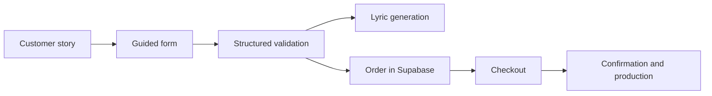

# Escribe Tu Canción — Landing & Checkout

This landing experience turns an emotional, unstructured idea into the exact information required for music production: occasion, relationship, names, style, voice, references, personal details, delivery, and contact information.

It is the entry point to a three-part platform. The purchase flow feeds the operational dashboard and the product's conversational agent.

**Development approach:** Built entirely with AI, with human direction and validation.

## At a glance

| Metric | Value |
| --- | ---: |
| UI components | 43 |
| Specialized form components | 18 |
| API routes | 4 |
| End-to-end coverage | Playwright |

## The problem

Requesting “a personalized song” sounds simple, but real customer input is often incomplete, ambiguous, and expressed in natural language. The form reduces that uncertainty without turning an emotional purchase into a cold questionnaire.



## What makes this implementation stand out

- **Progressive capture:** Each step asks for one decision while preserving the accumulated context.
- **Purposeful AI:** Models turn personal details into a first lyric draft without replacing the business workflow.
- **Order-aware checkout:** Stripe and its webhooks connect purchase intent to payment confirmation.
- **Flexible experiences:** Seasonal variations, pricing, currency, analytics, and experiments can change without rewriting the core journey.
- **Validation before persistence:** React Hook Form and Zod protect the data contract consumed by the dashboard.

## Relevance to service booking

The form demonstrates a useful online-booking pattern: transforming a need expressed in natural language into a complete operational record. Conditional fields, validation, pricing, and payment can support a service request without forcing the customer to understand the company's internal data model.

The key decision is not how many fields to display, but **when to request each piece of information**. That reduces abandonment and gives operations a job that is ready to process.

## Architecture and stack

| Area | Technology |
| --- | --- |
| Application | Next.js, React, and TypeScript |
| UI | Tailwind CSS, Radix UI, and Framer Motion |
| Forms | React Hook Form and Zod |
| Data | Supabase |
| AI | Vercel AI SDK, Google, and Groq |
| Payments | Stripe |
| Quality | Playwright, ESLint, and TypeScript |

## Technical decisions worth discussing

1. Modeling a long order form as independent steps without losing state.
2. Separating lyric generation from checkout to avoid unnecessary coupling.
3. Designing fallbacks for unavailable AI providers.
4. Keeping analytics and experimentation outside the form's core logic.

## Local setup

```bash
pnpm install
cp .env.example .env.local
pnpm dev
```

The application runs at `http://localhost:3000`. Run the end-to-end flow with:

```bash
pnpm test:e2e
```

`/.env.example` documents every required variable with placeholder values. The repository contains no credentials or customer data.
